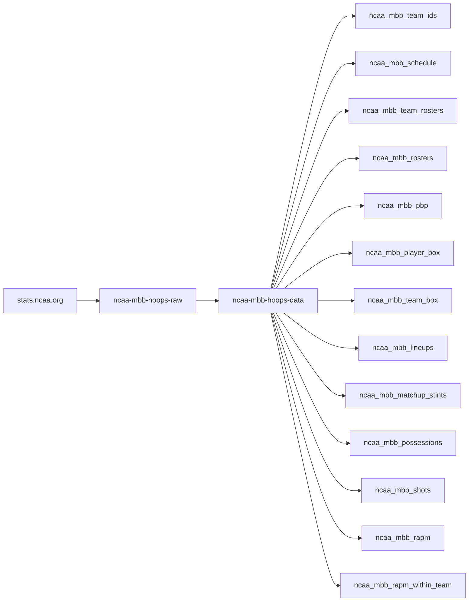
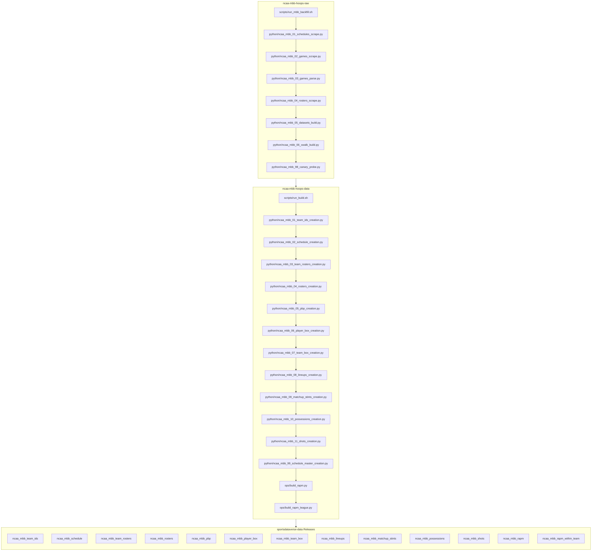

# ncaa-mbb-hoops-raw
NCAA MBB Raw Data

Raw-page capture + parse pipeline for `stats.ncaa.org` men's college
basketball. Three stages: **discover** (season -> contest_ids) -> **capture**
(contest -> 3-page HTML bundle) -> **parse** (bundle -> combined per-game
JSON). Data tree lives under `<root>/mbb/` (default root = repo root):
`schedule_master.parquet`, `raw/{season}/{contest_id}.json.gz`,
`json/{contest_id}.json`.

Three further committed datasets — **schedules**, **teams**, **rosters** — ride
along for free. `discover` already fetches every team's schedule page and
`rosters` already fetches every roster page, so both trees are persisted from
those existing fetches at **zero extra HTTP**; `teams` needs no fetch at all
(it is the bundled sdv-py crosswalk). Per team the source `html` and the parsed
`json` are kept; `parquet` is the one compiled dataset per season:

```
mbb/schedules/html/{season}/{team_id}.html     mbb/rosters/html/{season}/{team_id}.html
mbb/schedules/json/{season}/{team_id}.json     mbb/rosters/json/{season}/{team_id}.json
mbb/schedules/parquet/{season}.parquet         mbb/rosters/parquet/{season}.parquet
mbb/teams/{html,json,parquet}/{season}.*
```

Every one of them carries human-readable names next to the machine ids —
schedules pair `team_id`/`opponent_id` with `team`/`opponent`, rosters pair
`player_id` with `clean_name` (display form) *and* `player` (the ALL-CAPS
`FIRST.LAST` play-by-play join key), teams pair `ncaa_team_id` with the NCAA
name, conference and `division` (constant `"I"` — the crosswalk is scoped to
the Division-I `season_divisions` id).

**These three trees are also where the ESPN identity lives.** All three are
reference data, so each carries the ESPN team id from sdv-py's
`ncaa_espn_team_crosswalk`: schedules for both sides (`espn_team_id` /
`opponent_espn_team_id`), rosters for the roster's team, teams for the team
plus ESPN's display name and mascot. The **per-game** parsed families
(`pbp`, `possessions`, `player_box`, `team_box`, `shots`, `lineups`) carry
`*_ncaa_team_id`, the player ids and the readable names — but deliberately
**no** ESPN ids: repeating a reference id on millions of play rows is bloat,
so join `teams` on `ncaa_team_id` instead. Each parsed game does ship a
two-row `teams` block with the full ESPN identity for its own two sides.

On the play-by-play side the identity pass also resolves the ten on-court
slots — `home_1`..`home_5` / `away_1`..`away_5` on `pbp` and `possessions`
each gain `{slot}_player_id` + `{slot}_clean_name` — off the same
game-scoped roster index as `player_1`/`player_2`.

## ncaa-mbb-hoops workflow diagram





`scripts/run_mbb_backfill.sh` (raw) and `scripts/run_build.sh` (data) are the drivers;
`run_autocommit.sh` commits captures as they land. Stage numbers are intended build
order, not run order.

[hoopR-mbb-raw repository (source: ESPN)](https://github.com/sportsdataverse/hoopR-mbb-raw)

[hoopR-mbb-data repository (source: ESPN)](https://github.com/sportsdataverse/hoopR-mbb-data)

[hoopR-nba-raw repository (source: ESPN)](https://github.com/sportsdataverse/hoopR-nba-raw)

[hoopR-nba-data repository (source: ESPN)](https://github.com/sportsdataverse/hoopR-nba-data)

[hoopR-nba-stats-raw repository (source: NBA Stats)](https://github.com/sportsdataverse/hoopR-nba-stats-raw)

[hoopR-nba-stats-data repository (source: NBA Stats)](https://github.com/sportsdataverse/hoopR-nba-stats-data)

[ncaa-mbb-hoops-raw repository (source: stats.ncaa.org)](https://github.com/sportsdataverse/ncaa-mbb-hoops-raw)

[ncaa-mbb-hoops-data repository (source: stats.ncaa.org)](https://github.com/sportsdataverse/ncaa-mbb-hoops-data)

[hoopR-kp-data repository (source: KenPom, dormant)](https://github.com/sportsdataverse/hoopR-kp-data)

## Setup

Requires the sibling `sdv-py` checkout at
`C:/Users/saiem/Documents/GitHub-Data/sdv-dev/sdv-py` with its `.venv`
synced (`uv sync --all-extras --dev` there). Discover + capture also need
ProxyBonanza creds in `~/.Renviron` (or `~/Documents/.Renviron`):

```
PROXYBONANZA_API_KEY=...
PROXY_PKG=...
```

The launchers read these at call time and never print or persist the raw
values. `parse` is fully offline and needs no creds.

## Run order

```sh
bash scripts/run_01_schedules.sh --season 2026  # -> mbb/schedule_master.parquet (~5.5-6k contest_ids)
                                               #    + mbb/schedules/{html,json}/2026/
bash scripts/run_02_games.sh     --season 2026  # -> mbb/raw/2026/{contest_id}.json.gz
bash scripts/run_03_parse.sh                    # -> mbb/json/{contest_id}.json
bash scripts/run_04_rosters.sh   --season 2026  # -> mbb/rosters/{html,json}/2026/
bash scripts/run_05_datasets.sh  --season 2026  # -> the season parquets + mbb/teams/
```

`run_05_datasets.sh` is fully offline (no creds, no network) and **not sharded**:
each season parquet is a single output file, so concurrent `--shard` workers
would race it. Run it once, after the sharded sweeps finish. It also re-derives
any missing per-team json from committed html, so a parser fix can be replayed
across every captured season with `--overwrite` and no re-scrape.

Wrapper drivers around that per-stage sequence:

- `scripts/run_98_canary.sh` — **pre-flight**: score each proxy vendor in
  `canary_vendors.toml` against the same small bm-verify canary (10 games x 2
  pages per vendor) and write a scorecard you pick a vendor from. Cheap and
  gentle; creds come from that file, not `.Renviron`. Run it before a campaign
  when a vendor looks degraded. (The WBB twin documents this in its
  `docs/SCRAPING_NOTES.md` stage table; this repo's notes are a dated incident
  log, so it lives here.)

- `scripts/run_mbb_backfill.sh <season>` — one-command **single-season**
  chain (discover -> capture -> parse), resumable; `CHUNK=` / `WORKERS=`
  knobs per its header.
- `scripts/run_mbb_backfill_range.sh [start] [end]` — **multi-season
  campaign** (default 2025 down to 2010), newest-first, wrapping
  `run_mbb_backfill.sh` per season: capture runs in chunked rounds (a
  fresh sticky IP each chunk) with cooldowns between rounds and after
  ban hard-stops, and up to `MAX_ROUNDS` straggler rounds per season
  before moving on (re-run later to finish the remainder).
- `scripts/run_reference_backfill.sh [start] [end]` — reference-only
  companion to the pbp backfill: per season (newest-first) it chains
  `run_01_schedules.sh` -> sharded `ncaa_mbb_04_rosters_scrape.py` -> `run_05_datasets.sh`,
  then commits + pushes that season. Reference data is cheap (~2 pages
  per team-season vs 3 per game), so it runs first / independently of
  `run_mbb_backfill*.sh`; it does **no** pbp capture.
- `scripts/run_autocommit.sh` — incremental commit(+push) sweep of
  capture output every `INTERVAL` seconds. It stages only files whose
  mtime has settled at least `SETTLE` minutes, so an in-flight bundle
  is never committed half-flushed — safe to run **concurrently with an
  active capture**. The backfill drivers deliberately do not commit;
  this keeps the repo close to pushed during a long campaign.

Watch a running job live:

```sh
tail -f logs/capture_*.log
```

## Safe-rate rule (capture)

**The worker ceiling is pool-relative, not absolute** (user-verified
2026-08-01, `docs/SCRAPING_NOTES.md`): the old "1-2 workers max" rule was
measured on a shared datacenter pool. With per-worker DISJOINT sticky
residential ports (the `decodo_patchright` port pool), up to 8 workers have
run clean — what matters is **per-IP pacing**, and the fetcher shards the
port pool by worker index so workers never pile onto one port. Each worker is
a *separate process* running `run_02_games.sh` with a disjoint `--shard i/N`
-- never threads inside one process. On a shared/unsharded pool, stay at 1-2:

```sh
./scripts/run_02_games.sh --season 2026                    # 1 worker (proven-safe default, ~6h)
./scripts/run_02_games.sh --season 2026 --shard 0/2 &       # 2 workers (~4h), only after 1-worker is stable
./scripts/run_02_games.sh --season 2026 --shard 1/2 &
```

A ban-suspect response is a **hard stop**, not a retry: the process exits
immediately (`BAN-SUSPECT: capture halted at contest_id=...`). Wait out the
cooldown before resuming -- do not immediately re-launch.

⚠️ On a persistent ban, the upstream `NcaaFetcher` retries across the entire
residential proxy pool with no delay before raising -- so a single
ban-detection can send a ~pool-sized burst before the scraper hard-stops.
This is bounded (the run terminates), but re-running immediately into a live
ban will re-churn the pool. On a `BAN-SUSPECT` stop, WAIT for a multi-minute
cooldown before resuming. (Follow-up: add inter-rotation backoff upstream in
sdv-py.)

## Resume story

Every stage is idempotent and re-runnable:

- **discover** merges new contest_ids into the existing `schedule_master.parquet`
  (and checkpoints each swept team page under `mbb/.discover/{season}/`, so an
  aborted sweep resumes instead of restarting).
- **capture** resume is **file-exists based**: a contest is skipped iff its
  `mbb/raw/{season}/{contest_id}.json.gz` bundle is already on disk. The
  master's `captured` column is vestigial (always `False`) — see
  `docs/SCRAPING_NOTES.md` §5. Re-running after a ban-suspect stop (or a plain
  interruption) picks up where it left off.
- **parse** skips any contest_id that already has a `mbb/json/{contest_id}.json`
  output; re-running only parses newly captured bundles.

So `bash scripts/run_01_schedules.sh --season 2026 && bash scripts/run_02_games.sh --season 2026 && bash scripts/run_03_parse.sh`
is safe to re-run wholesale after any interruption.

## Status

The `python/` package (league-binding shims over the shared
`sportsdataverse.scrape.ncaa` engine, sdv-py #328/#330) is complete and
validated offline. **The reference backfill HAS run live**: schedules,
rosters and teams for 2010-2026 are committed under `mbb/`. **The pbp
capture is in progress** -- see `docs/RESUME.md` for the current
season-by-season count (56,039/100,037 games as of the last recorded
checkpoint) and where to resume it.

## Phase 2: the season `-data` builder

The season `-data` builder lives in the sibling repo
`../ncaa-mbb-hoops-data` (package `ncaa_mbb_data_build`), mirroring
`../ncaa-wbb-hoops-data`. It ingests this repo's committed `mbb/` tree over
HTTP from `main`, which is why the data tree must stay committed (see
`.gitignore`).

## Reports & explainers

<!-- BEGIN GENERATED: reports -->

| Report | What it is | Last updated |
|---|---|---|
| [Resume the NCAA basketball backfill](docs/RESUME.md) | explainer | 2026-08-11 |
| [stats.ncaa.org scraping — everything we know](docs/SCRAPING_NOTES.md) | explainer | 2026-08-12 |

<!-- END GENERATED: reports -->

## Automation & status

<!-- BEGIN GENERATED: status -->

| workflow | schedule | last run |
|---|---|---|
| [](https://github.com/sportsdataverse/ncaa-mbb-hoops-raw/actions/workflows/orphan_scripts.yml) | on push / PR / dispatch | 2026-08-21 |
| [](https://github.com/sportsdataverse/ncaa-mbb-hoops-raw/actions/workflows/tests.yml) | on push / PR / dispatch | 2026-08-21 |

<!-- END GENERATED: status -->
